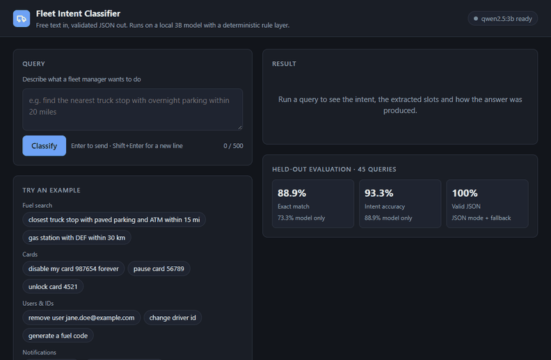
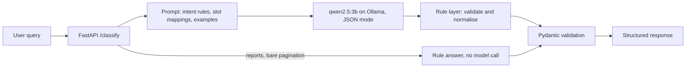

# Fleet Management Intent Classifier

[](https://github.com/RoshanMishra0/fleet-management-intent-classifier/actions/workflows/ci.yml)

Intent classification and slot extraction for fleet-management requests, running entirely on a local 3B-parameter LLM. A free-text query goes in; validated JSON that an application can act on comes out. No query, card number or email leaves the machine.

```
"disable my card 987654 forever"   →   { "intent": "CARD_MANAGEMENT", "action": "block", "card_number": "987654", ... }
```



*34-second demo recorded on the local service (qwen2.5:3b on a GTX 1660 Ti). Run it yourself with the [quick start](#quick-start).*

## Results

Evaluated on 45 held-out queries ([`data/test_cases_heldout.json`](data/test_cases_heldout.json)) covering all eight intents. None of them was used to write the prompt or the rule layer.

| Metric | Model only | Model + rule layer |
| --- | --- | --- |
| Intent accuracy | 88.89% (40 of 45) | **93.33%** (42 of 45) |
| Slot accuracy | 85.48% | **91.13%** |
| Exact match (every field correct) | 73.33% (33 of 45) | **88.89%** (40 of 45) |
| Valid JSON | 100% | 100% |
| Average latency | | 5.16 s per query |

Model: `qwen2.5:3b` on Ollama, temperature 0, JSON mode.
Measured on: Intel Core i5-9300H, NVIDIA GTX 1660 Ti (6 GB), 16 GB RAM.

Exact match is the strict number: one wrong slot fails the whole case. Per-case output: [`results/service_test_cases_heldout.json`](results/service_test_cases_heldout.json) (service) and [`results/model_only_test_cases_heldout.json`](results/model_only_test_cases_heldout.json) (model alone).

On the original 45 test cases ([`data/test_cases.json`](data/test_cases.json)) the model alone scored 77.78% exact match ([`results/model_only_test_cases.json`](results/model_only_test_cases.json)), and a live run with the rule layer scores 100% on every metric. That set was used to design the rules, so the held-out numbers above are the ones to quote.

## How it works



1. `api.py` exposes `POST /classify` and validates the request with Pydantic (non-blank, at most 500 characters).
2. `prompt.py` builds one prompt containing the intent definitions, the slot normalisation rules (for example "truck stop" → `TS`, "disable" → `hold`, "forever" → `block`), conflict-resolution rules and two worked examples.
3. `llm.py` calls Ollama in JSON mode at temperature 0, so the same query gives the same answer.
4. `rules.py` validates the output and applies the fixed business rules (see below).
5. The result is validated against `ClassificationResponse` in `schemas.py`. If the model output cannot be parsed, the service returns `UNKNOWN` with confidence 0 instead of failing. If Ollama is down or times out, the API answers `503` without exposing internal details.

### The rule layer

The model decides what the user means. Rules that never change are enforced in code, where they are cheap, testable and always applied.

- **Before the model.** Report, dashboard and summary requests, and bare pagination phrases such as "what else", are answered as `UNKNOWN` without a model call.
- **After the model.** The action is mapped to the allowed business value for the intent ("remove" → `block`, "create" → `generate`). A value the model returns is kept when it is valid and replaced by a rule when it is missing or outside the allowed list. Card numbers and emails must appear in the query. Slots that do not belong to the intent are cleared.

`python -m evaluation.replay` replays the recorded model outputs from the first evaluation through this layer. On those 45 cases every failure is corrected, and 7 of the 45 need no model call. That is not a headline result: the rules were written after studying those same failures. The honest test is the held-out set, 45 new queries the rules were not tuned on.

### Why a small local model

The task needs instruction following, classification, extraction, value normalisation and JSON output in a single call. A 3B generative model handles all five, and it runs on local hardware: there is no per-request API cost, and queries containing card numbers and email addresses stay local.

## Supported intents

| Intent | Covers | Normalised actions |
| --- | --- | --- |
| `FUEL_SEARCH` | Find, nearest or cheapest fuel locations. Slots: merchant type (`TS`, `GS`, `FS`), fuel type, radius and unit, amenities | none |
| `CARD_MANAGEMENT` | Activate, pause or cancel a card | `activate`, `hold`, `block` |
| `CARD_UNLOCK` | Only when the word "unlock" appears | none |
| `USER_MANAGEMENT` | Remove or suspend a user; any query with an email address | `deactivate` |
| `FUEL_CODE` | Fuel code requests | `generate`, `cancel`, `list`, `status` |
| `PROMPTED_ID_MANAGEMENT` | PIN, PID, prompted ID or driver ID requests | `create`, `activate`, `inactivate`, `change`, `details` |
| `NOTIFICATION_MANAGEMENT` | Notifications, alerts and exceptions | `enable`, `disable`, `enable_all`, `disable_all`, `details` |
| `UNKNOWN` | Analytics and report requests, standalone pagination, anything unsupported | none |

A few of the business rules the model has to apply:

- Fuel type defaults to `Diesel` when a fuel search does not name one.
- "Parking" with no qualifier expands to all three parking amenity codes.
- "Permanently", "forever" or "for good" turns any card action into `block`.
- "Next option", "another one", "show me another" and "what else" set `pagination_action` to `next`.

## Error analysis

In the model-only run, ten of the 45 cases failed exact match. They fall into three groups.

| Failure | Cases | Example |
| --- | --- | --- |
| Action missing or not mapped to the business value | 5 | "remove card 5555" returned `remove`; expected `block` |
| Report or bare pagination request classified as `NOTIFICATION_MANAGEMENT` instead of `UNKNOWN` | 4 | "generate fuel usage report" |
| Amenity list incomplete | 1 | generic "parking" returned one code instead of three |

The pattern matters more than the count. Every failure was a fixed rule the model did not apply, not a request it misunderstood. Fixed rules are cheaper and more reliable in code than in a prompt, which is why the rule layer exists.

### Held-out run with the rule layer

Five of the 45 held-out cases still fail. They have been left unfixed so the held-out numbers stay honest.

| Failure | Cases | Example |
| --- | --- | --- |
| Lost or stolen card classified as `USER_MANAGEMENT` | 2 | "I lost my card 112233" |
| Pagination with a business object classified as `NOTIFICATION_MANAGEMENT` | 1 | "show me another truck stop" |
| Valid but wrong model value kept over the wording in the query | 2 | "show fuel codes" returned `generate`, expected `list`; "gasoline station with cng" returned `Gas`, expected `CNG` |

The first two groups are intent errors by the model; the rules only act after the intent is chosen. The last group comes from a design choice: the rule layer keeps any value the model returns that is in the allowed list. Preferring an explicit word in the query over the model's value would fix both cases.

## Known limitations

- **Small test set.** With 45 cases, one case moves a metric by about 2.2 points.
- **Original test set is not fully held out.** One of its queries is also a worked example in the prompt, and the rule layer was designed from its failures. Use `data/test_cases_heldout.json` for any claim about the rule layer.
- **Rules cover the listed wording only.** A paraphrase outside the synonym lists ("turn off my card") still depends on the model.
- **Latency.** About 5 seconds on a laptop GPU is too slow for an interactive assistant. The full rule prompt is sent on every request.
- **Confidence is not calibrated.** The `confidence` field is the model's own estimate.
- **Valid JSON depends on JSON mode.** The 100% rate comes from Ollama's JSON mode, with the `UNKNOWN` fallback behind it.

## Production setup

- **Package layout.** Prompt, model client, rules, pipeline and HTTP layer are separate modules; the API is built by `create_app()`, so tests inject a fake model.
- **Configuration** comes from environment variables (below), with defaults for local use.
- **Model warm-up.** The model is loaded in the background at startup and kept in memory (`keep_alive`), so the first request does not pay a cold load of up to a minute.
- **Health checks.** `GET /health` for liveness; `GET /health/ready` checks that Ollama is reachable and the model is pulled (`503` otherwise).
- **Errors.** Model outages return `503` with a generic message; invalid input returns `422`.
- **Privacy.** Logs record intent, source and latency, never the query text, which can contain card numbers and email addresses.
- **Tests.** 50 unit and API tests run without a model, on every push, in GitHub Actions.
- **Docker.** `docker compose up` runs the API and Ollama together; the image runs as a non-root user with a health check.
- **Pinned dependencies** in `requirements.txt` and `requirements-dev.txt`.

## Quick start

Requires Python 3.10+ and [Ollama](https://ollama.com).

```bash
python -m venv .venv
source .venv/bin/activate        # Windows: .venv\Scripts\activate
pip install -r requirements.txt
ollama pull qwen2.5:3b
uvicorn fleet_intent.api:app
```

- Demo page: http://127.0.0.1:8000
- Interactive API docs: http://127.0.0.1:8000/docs

### With Docker

```bash
docker compose up -d
docker compose exec ollama ollama pull qwen2.5:3b
```

For GPU inference, uncomment the `deploy` block in `docker-compose.yml`.

### Configuration

| Variable | Default | Meaning |
| --- | --- | --- |
| `OLLAMA_URL` | `http://localhost:11434` | Ollama server |
| `MODEL_NAME` | `qwen2.5:3b` | Model to call |
| `LLM_TIMEOUT_SECONDS` | `120` | Timeout for one model call |
| `OLLAMA_KEEP_ALIVE` | `30m` | How long Ollama keeps the model loaded after a request |
| `WARM_UP_MODEL` | `true` | Load the model in the background at startup |
| `LOG_LEVEL` | `INFO` | Log level |

## API

| Method | Path | Purpose |
| --- | --- | --- |
| `POST` | `/classify` | Classify a query |
| `GET` | `/health` | Liveness |
| `GET` | `/health/ready` | Readiness: Ollama reachable and model pulled |
| `GET` | `/` | Demo page |

### Request

```bash
curl -X POST http://127.0.0.1:8000/classify \
  -H "Content-Type: application/json" \
  -d '{"query": "disable my card 987654 forever"}'
```

### Response

```json
{
  "intent": "CARD_MANAGEMENT",
  "action": "block",
  "merchant_type": null,
  "fuel_type": null,
  "radius": null,
  "radius_unit": null,
  "amenities": [],
  "card_number": "987654",
  "email": null,
  "pagination_action": null,
  "confidence": 0.95,
  "source": "model",
  "latency_ms": 4310.2
}
```

`source` is `rules` when the answer needed no model call, and `model` otherwise.

| Status | When |
| --- | --- |
| `422` | Missing, blank or over-long query (500 characters) |
| `503` | Ollama unreachable, timed out or returned an error |

## Tests and evaluation

```bash
pip install -r requirements-dev.txt
pytest                                                # 50 tests, no model needed
```

With the server running:

```bash
python -m evaluation.evaluate                         # held-out set -> results/service_test_cases_heldout.json
python -m evaluation.evaluate data/test_cases.json    # original set -> results/service_test_cases.json
```

Without the server:

```bash
python -m evaluation.evaluate --model-only            # model alone, no rule layer
python -m evaluation.replay                           # rule layer on recorded model outputs, no model needed
```

Each run prints the metrics and the failed cases side by side, and writes the per-case results to `results/`.

## Project structure

```
fleet_intent/            the service
  api.py                 FastAPI app: /classify, health checks, demo page
  service.py             pipeline: rule pre-check -> model -> rule layer
  llm.py                 Ollama client: JSON mode, timeouts, warm-up, readiness
  prompt.py              the prompt (unchanged from the measured version)
  rules.py               rule layer: pre-check, action mapping, slot validation
  schemas.py             Pydantic request and response models
  config.py              settings from environment variables
  static/index.html      demo page (no build step, no external requests)
evaluation/
  evaluate.py            runs a test set through the service or the model alone
  replay.py              replays recorded model outputs through the rule layer
  scoring.py             metrics shared by both
data/                    labelled test sets (original and held-out)
results/                 per-case evaluation reports
tests/                   rule, API, client and scoring tests
```

## Roadmap

- [x] Rule layer: per-intent allowed actions, synonym map, slot validation
- [x] Rule pre-check for bare pagination and reporting requests
- [x] Held-out test set (45 cases) and fresh evaluation with the rule layer
- [x] Unit and API tests, CI, pinned dependencies
- [x] Health checks, model warm-up, Docker, demo page
- [ ] Grow the held-out set to 200+ cases with paraphrases and typos
- [ ] Prefer an explicit word in the query over a valid model value (fixes two held-out failures; needs a fresh test set to measure)
- [ ] Side-by-side comparison with two other small local models
- [ ] Lower latency: shorter prompt, system prompt kept warm through the chat endpoint, schema-constrained output

## Tech stack

Python, FastAPI, Pydantic, Ollama, Qwen 2.5 (3B), pytest, Docker, GitHub Actions

## License

[MIT](LICENSE)
